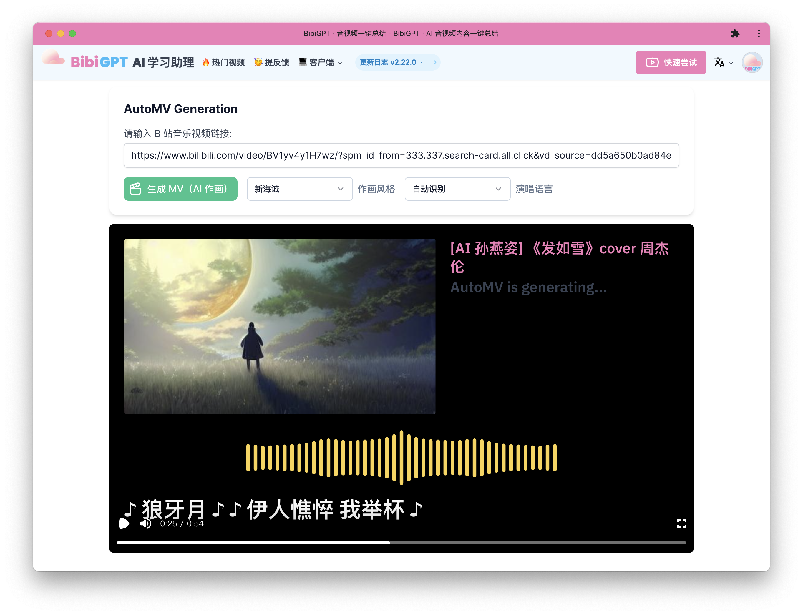
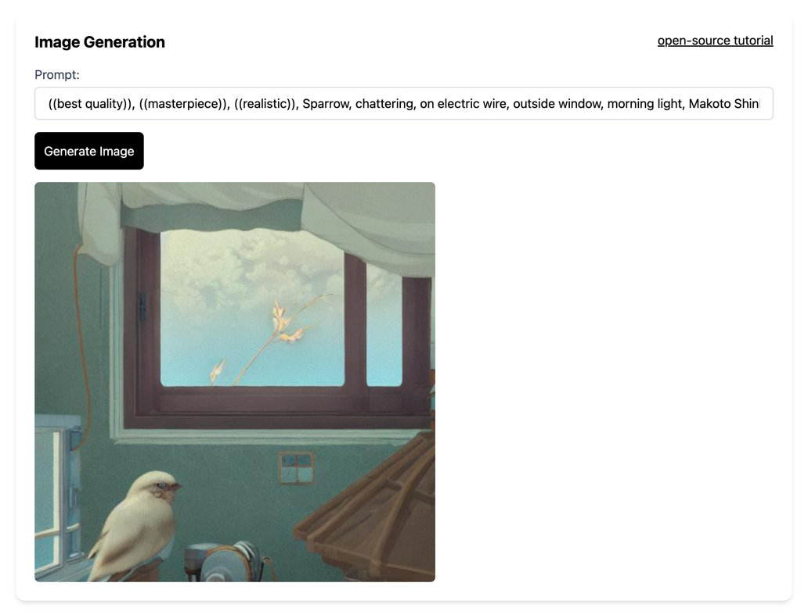

# 🎨 AWS Sage Maker Stable Diffusion DEMO

A simple web GUI for painting with [Stable Diffusion](https://catalog.us-east-1.prod.workshops.aws/workshops/3b86fa89-da3a-4e5f-8e77-b45fb11adf4a) using the AWS SageMaker Inference Endpoint.

Try my online #AutoMV application at [BibiGPT.co](https://bibigpt.co/player)



This demo app is hosted at [https://sd.aitodo.co](https://sd.aitodo.co) but without AWS tokens (because it would cost a lot! 🤣)



## How it works

🐢🚀 This is a Node.js app! It's powered by:

- [AWS Sage Maker](https://aws.amazon.com/sagemaker/), a platform for running machine learning models in the cloud.
- [Stable Diffusion](https://huggingface.co/spaces/stabilityai/stable-diffusion), an open-source text-to-image generation model.
- Next.js [server-side API routes](pages/api) for talking to the Replicate API
- Next.js React components for the inpainting GUI
- [Tailwind CSS](https://tailwindcss.com/) for styling
- [Lucide](https://lucide.dev/) for Icons

## Development

Prerequisites:

1. Recent version of Node.js
2. [SageMaker Inference Endpoint](https://aws.amazon.com/sagemaker/)
3. [AWS Identity and Access Management (IAM)](https://aws.amazon.com/iam/)


Set your AWS token in your environment:

```
AWS_ACCESS_KEY_ID=
AWS_SECRET_ACCESS_KEY=
```

Then install dependencies and run the server:

```sh
npm install
npm run dev
```

Open [http://localhost:3000](http://localhost:3000)
